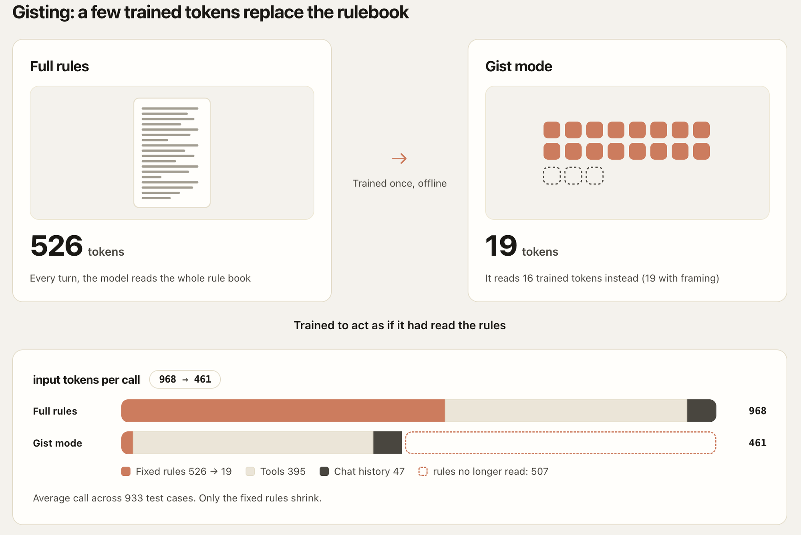

[English](README.md) | [简体中文](README.zh-CN.md)

# OpenGisting

OpenGisting is a customer-service agent demo where **16 trained gist tokens**
replace the fixed rules prompt. The base model weights remain untouched.
The agent calls tools to look up synthetic orders and answers from verified facts.
Full-prompt and Gist modes make prompt-token savings inspectable.

[Try the live demo](https://www.myagenthubs.com/opengisting/).

Demo orders are synthetic test data. Access requires both an order number and
its demo email. The demo page provides eight public order examples; other demo
emails are redacted in this repository. Seeds, canaries, tracking numbers,
ETAs, scenarios, evaluation cases, transcripts, and reports are synthetic data.



## What the savings mean

The measured fixed-rules segment shrinks from **526 to 19 input tokens**:
16 learned vectors plus 3 tokens of system framing. Tool schemas, conversation
history, and tool results stay outside the compression boundary.

The webpage's controlled per-call illustration is **968 → 461 input tokens**
(about 52.4% fewer): rules + 395 tool tokens + 47 rounded history/result tokens.
It holds the Gist run's average history/result size constant in both modes;
it is not the two runs' independently measured input averages.
Across 933 graded cases, the reports record 877 model-using turns per mode:
actual mean input per such turn is 971.184 (Full) and 477.734 (Gist), with
881 and 908 model calls respectively. Savings are input-token savings,
not a latency or equal-quality claim. Raw model errors remain visible separately
from the runtime-checked final replies.

Evidence: [Full report](eval/reports/ee6c5c626278120523b9af02255958c0c9f5048c/full/report.json),
[Gist report](eval/reports/ee6c5c626278120523b9af02255958c0c9f5048c/gist/report.json), and
[composition derivation](src/gisting/eval/web_benchmarks.py).
Only the 16 gist vectors are trained; the Qwen3-1.7B model weights remain unchanged.
[Gist weights and manifest](https://huggingface.co/ImPanda/how-shopify-gisting-works)
are available on Hugging Face. See the [usage guide](docs/guides/using-gist-tokens.md)
for download commands and exact compatibility requirements.

## Guides

- [Architecture](docs/guides/architecture.md): decisions, tools, and final replies.
- [Using gist tokens](docs/guides/using-gist-tokens.md): artifacts and opt-in commands.
- [Fixed rules](docs/guides/fixed-rules.md): exactly what 526 → 19 replaces.
- [Training](docs/guides/training.md): context distillation and its audit boundary.

## Repository layout

- `src/gisting/`: prompts, tools, agent, model serving, training, and evaluation.
- `apps/web/`: chat interface and prompt-token explanations.
- `apps/gateway/`: request validation, quotas, and the proxy to the model server.
- `prompts/`, `kb/`, `data/`: rules, policy knowledge, and synthetic fixtures.
- `eval/`: cases, graders, metrics, baselines, and recorded reports.
- `contracts/`: generated schemas shared with the web application.
- `scripts/`, `tests/`: checks and offline tests.
- `docs/design/`, `docs/decisions/`: design and engineering decisions.

## Quickstart

Use Python 3.11, uv, Node.js, and pnpm. Optional local tools such as gitleaks
and shellcheck extend the checks.

```sh
uv sync
make check
make check-ts
```

These commands install dependencies and run checks; they do not download model
weights or start the live service. Model setup is separate; see
[`scripts/download-models.sh`](scripts/download-models.sh) and the [usage guide](docs/guides/using-gist-tokens.md).
Environment variable names and empty secret placeholders are in `.env.example`.

## License and credit

OpenGisting is licensed under [Apache-2.0](LICENSE).
The base model is [Qwen3-1.7B](https://huggingface.co/Qwen/Qwen3-1.7B),
also licensed under Apache-2.0.

This project learns from Shopify Engineering's
[Gisting post](https://shopify.engineering/gisting).
