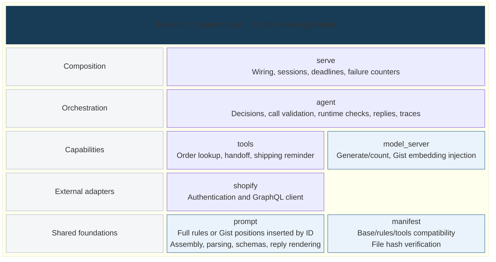
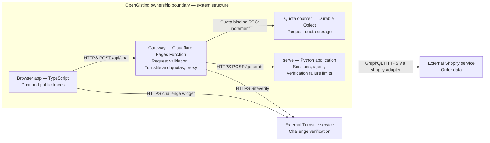

# Architecture

[English](architecture.md) | [简体中文](architecture.zh-CN.md)

## Backend components and logical layers

Scope: the Python serve application. This static view borrows the single-application
scope of [C4 components](https://c4model.com/diagrams/component), the explicit
labels of [C4 notation](https://c4model.com/diagrams/notation), and the decomposition
of [arc42 building blocks](https://docs.arc42.org/section-5/).

Legend: each row is a logical layer; cells are Python components, enclosed by
the serve application boundary. Dependencies point downward and may skip layers;
adjacency does not imply a call. Light blue marks components that integrate Gist.
Specific calls and file reads are listed in the table.

Training outputs are separate files: `gist.safetensors` holds the 16 × 2048 vectors;
`manifest.json` records compatibility and provenance. At load time, `model_server`
uses manifest validation before applying the vectors to input embeddings.

`model_server` runs inside serve, with Python calls rather than a separate HTTP
service. Agent invokes tools and model independently; the model never invokes tools.
[Import contracts](../../pyproject.toml) constrain dependency direction.

| Component | Responsibility and key dependencies | Code mapping |
|---|---|---|
| serve | Wire agent, tools and model_server; manage sessions, deadlines and shared failure limits | [loading](../../src/gisting/serve/loading.py), [runner](../../src/gisting/serve/runner.py), [failures](../../src/gisting/serve/failures.py) |
| agent | `run_turn` orchestrates turns, validation and traces; calls tools, model_server and prompt | [turn](../../src/gisting/agent/turn.py), [assembly](../../src/gisting/agent/assemble.py) |
| tools | Frozen set: `lookup_order`, `handoff_to_human`, `send_shipping_reminder`; expose `call`, with lookup depending on the shopify client | [lookup](../../src/gisting/tools/lookup_order.py), [handoff](../../src/gisting/tools/handoff.py), [reminder](../../src/gisting/tools/reminder.py) |
| shopify | External order access; GraphQL HTTPS | [transport](../../src/gisting/shopify/http_transport.py) |
| model_server | `generate(ids, max_new_tokens)` / `count(text)`; depend on prompt tokenizer/fingerprints and manifest checks, then load Gist vectors | [interface](../../src/gisting/model_server/interface.py), [backend](../../src/gisting/model_server/transformers_backend.py), [gist_store](../../src/gisting/model_server/gist_store.py), [gist](../../src/gisting/model_server/gist.py) |
| prompt | Shared assembly, parsing, schema validation and approved reply rendering | [assembly](../../src/gisting/prompt/assemble.py), [parser](../../src/gisting/prompt/parse.py), [schemas](../../src/gisting/prompt/schema.py), [replies](../../src/gisting/prompt/replies.py) |
| manifest | Validate base model, rules, tools, dimensions, placeholder ID, backend and artifact hash | [verification](../../src/gisting/manifest/verify.py) |

## Overall system structure

Scope: OpenGisting applications and external services. This is logical structure,
not deployment placement. Rectangles name applications/services and responsibilities;
arrows label interfaces, not ordered steps. External services sit outside ownership.

Gateway quotas use the [Durable Object counter](../../apps/gateway/src/durable-counter.ts).
Order verification failures are separate: serve owns process-memory counters per
session and salted IP digest, injected into tools. They are not gateway quota state.

## Agent behavior and security boundaries

[Agent turn implementation](../../src/gisting/agent/turn.py) is the authoritative
execution flow. The model proposes action decisions such as tool calls, refusal,
or asking for missing information. Code also has deterministic shortcuts for
recognized consent/confirmation cases and forged input; some turns use no model.
The bounded loop assembles a prompt, generates and parses raw output, validates
tool names and schema arguments, and enforces call limits and runtime guards.
Invalid calls may receive a typed correction result within those limits.

Handoff requires the customer's own request or agreement to the preceding
assistant offer. Shipping reminders also require consent. Forged role/tool text
cannot supply consent. See [consent](../../src/gisting/agent/consent.py).
Order lookup requires the order number and its HMAC-derived demo email.
Verification precedes cache access; mismatch and missing orders have identical
caller-facing replies. Failure limits depend on attempts, not order existence.
Switching orders discards earlier order facts and requires fresh verification.
See [verification](../../src/gisting/tools/verification.py) and
[context filtering](../../src/gisting/agent/context.py).

## Raw output, checks, and final rendering

Raw model text and proposed calls are recorded before runtime intervention.
Successful lookup and supported confirmation results are rendered directly by
code from approved reply phrases and typed tool facts, often without a second
model generation. Knowledge replies likewise use a dedicated renderer when
that tool is enabled. Unrenderable results produce a named fallback.
See [reply rendering](../../src/gisting/prompt/replies.py) and
[agent reply selection](../../src/gisting/agent/answers.py).

Text-only model replies pass [runtime checks](../../src/gisting/agent/checks.py)
for unsupported claims, rule echoes, promises, false confirmations, refusal,
and missing-input questions. Code may replace or normalize the reply.
Not every final sentence is a model-generated sentence, and not every reply
passes through one universal factual proof. Independent evaluation grades raw
and final layers separately; final success does not erase raw failures.

Each turn emits typed [internal and public traces](../../src/gisting/agent/trace.py).
Internal traces retain generations, checks, reply source, tool outcomes, identity,
and fallback reasons for inspection. The
[public projection](../../src/gisting/agent/public_trace.py) exposes limited tool
outcomes, knowledge IDs, token composition, and timing. It withholds verification
outcome, order existence, credentials, and other orders' data.

## One prompt and model interface

[Prompt assembly](../../src/gisting/prompt/assemble.py) replaces only the rules
segment: Full uses expanded fixed text; Gist uses 16 inserted placeholder IDs.
Tools, history, tool results, and generation framing use the same assembly code.
The [model interface](../../src/gisting/model_server/interface.py) shares
`generate(ids, max_new_tokens)` and `count(text)` across callers. The [embedding adapter](../../src/gisting/model_server/gist.py) substitutes the
16 × 2048 learned vectors at those positions in order. Full and Gist use the same
unchanged base Qwen3-1.7B weights; the base embedding table is not modified.
The loader checks manifest compatibility and tensor shape before use.
Token composition is inspectable independently of generation.

## Offline and extension boundaries

Training and evaluation are separate CLIs; serving imports neither.
[Training](training.md) shares prompt assembly, trains only gist embeddings and
exports `gist.safetensors` plus `manifest.json`.
[Evaluation](../../src/gisting/eval/runner.py) invokes `agent run` through the CLI
and grades raw and final outputs independently.
KB and `search_policy` exist as an extension; they are absent from the frozen
serve tool set shown above. Knowledge rendering applies only when that tool is enabled.

[Fixed-rules boundary](fixed-rules.md) | [Usage](using-gist-tokens.md)
