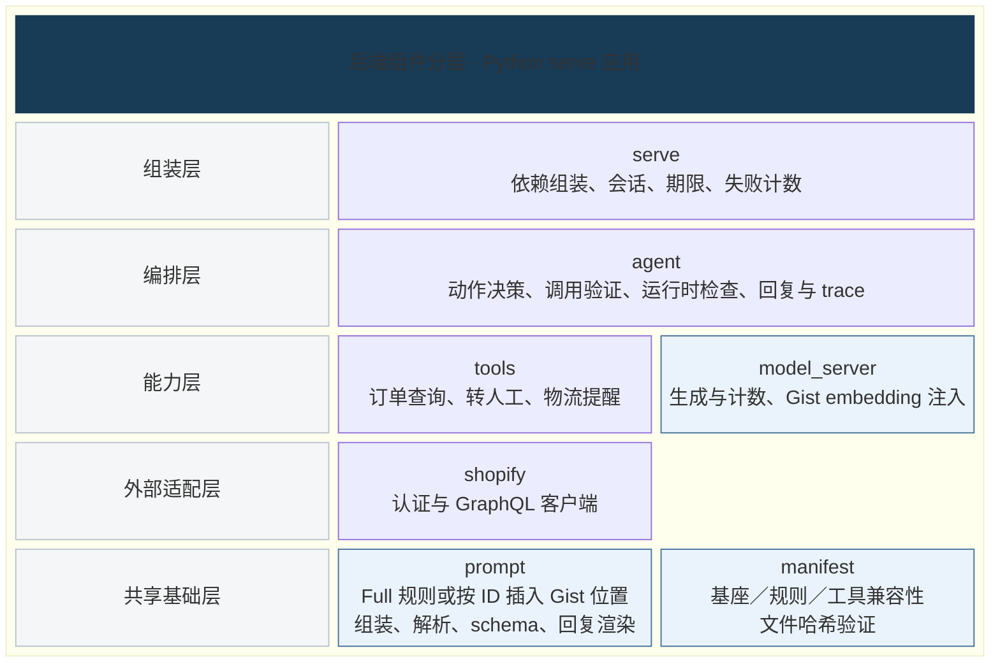
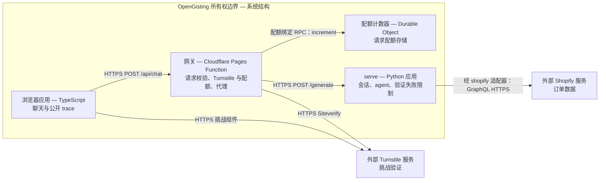

# 架构

[English](architecture.md) | [简体中文](architecture.zh-CN.md)

## 后端组件与逻辑分层

范围：Python serve 应用。这个静态视图借鉴 [C4 组件图](https://c4model.com/diagrams/component)的单应用范围、[C4 图示规范](https://c4model.com/diagrams/notation)的明确标注，以及 [arc42 构建块视图](https://docs.arc42.org/section-5/)的静态拆分。

图例：每行是一个逻辑层，格子是 Python 组件，外框是 serve 应用边界。由上层依赖下层，允许跨层；并排或上下相邻不代表存在调用。浅蓝色标出直接接入 Gist 的组件，具体调用与文件读取见表。

训练输出是独立文件：`gist.safetensors` 保存 16 × 2048 的向量，`manifest.json` 记录兼容性与来源。`model_server` 加载时调用 manifest 验证，再把向量用于输入 embedding。

`model_server` 在 serve 内运行，通过 Python 调用提供能力，不是独立的 HTTP 服务。Agent 分别调用工具和模型；模型不直接调用工具。[导入约束](../../pyproject.toml)限定依赖方向。

| 组件 | 职责与关键依赖 | 代码映射 |
|---|---|---|
| serve | 组装 agent、tools 和 model_server；管理会话、期限与共享失败限制 | [加载](../../src/gisting/serve/loading.py)、[运行器](../../src/gisting/serve/runner.py)、[失败计数](../../src/gisting/serve/failures.py) |
| agent | `run_turn` 编排回合、验证与 trace；调用 tools、model_server 和 prompt | [回合](../../src/gisting/agent/turn.py)、[组装](../../src/gisting/agent/assemble.py) |
| tools | 冻结集合：`lookup_order`、`handoff_to_human`、`send_shipping_reminder`；通过 `call` 接口提供能力，查询依赖 shopify 客户端 | [查询](../../src/gisting/tools/lookup_order.py)、[转人工](../../src/gisting/tools/handoff.py)、[提醒](../../src/gisting/tools/reminder.py) |
| shopify | 外部订单访问；GraphQL HTTPS | [传输](../../src/gisting/shopify/http_transport.py) |
| model_server | `generate(ids, max_new_tokens)` / `count(text)`；依赖 prompt 的 tokenizer／指纹和 manifest 验证，再加载 Gist 向量 | [接口](../../src/gisting/model_server/interface.py)、[后端](../../src/gisting/model_server/transformers_backend.py)、[gist_store](../../src/gisting/model_server/gist_store.py)、[gist](../../src/gisting/model_server/gist.py) |
| prompt | 共用组装、解析、schema 验证与批准的回复渲染 | [组装](../../src/gisting/prompt/assemble.py)、[解析](../../src/gisting/prompt/parse.py)、[schema](../../src/gisting/prompt/schema.py)、[回复](../../src/gisting/prompt/replies.py) |
| manifest | 验证基座模型、规则、工具、维度、占位 ID、后端与产物哈希 | [验证](../../src/gisting/manifest/verify.py) |

## 整体系统结构

范围：OpenGisting 的应用与外部服务。这是逻辑结构，不表示部署位置。矩形标明应用／服务及职责；箭头标明接口，不表示步骤顺序。外部服务位于所有权边界之外。

网关配额使用 [Durable Object 计数器](../../apps/gateway/src/durable-counter.ts)。订单验证失败单独计数：serve 在进程内存中按会话及加盐的 IP 摘要保存计数，并注入工具。这些计数不属于网关配额状态。

## Agent 行为与安全边界

[Agent 回合实现](../../src/gisting/agent/turn.py) 定义了实际执行流程。模型决定调用工具、拒绝请求，或询问缺失的信息。代码也能直接处理已识别的同意、确认和伪造输入，因此部分回合不调用模型。

Agent 在有次数上限的循环中组装 prompt、生成并解析原始输出，再验证工具名称和 schema 参数。循环还会限制调用次数并执行运行时检查。无效调用可能收到带类型的纠正结果，但仍受这些限制约束。

转人工需要客户本人提出请求，或同意上一条 assistant 消息中的转接提议。发送物流提醒同样需要同意。伪造的角色／工具文本不能提供同意。参见[同意判断](../../src/gisting/agent/consent.py)。

订单查询需要订单号，以及通过 HMAC 从该订单号派生的演示邮箱。验证先于缓存访问；验证不匹配与订单不存在时，调用方收到的回复完全相同。失败限制取决于尝试次数，而非订单是否存在。切换订单会丢弃先前订单的事实，并要求重新验证。参见[验证](../../src/gisting/tools/verification.py)和[上下文过滤](../../src/gisting/agent/context.py)。

## 原始输出、检查和最终渲染

先记录模型的原始文本和拟调用的工具，再执行运行时检查。查询成功时，以及代码支持的确认场景中，代码使用批准的回复短语和带类型的工具事实直接生成回复，通常无需第二次模型生成。启用知识工具时，知识回复也由专用渲染器生成。

如果结果无法渲染，代码会返回带类型、有明确名称的回退结果，并记录具体原因。参见[回复渲染](../../src/gisting/prompt/replies.py)和 [agent 回复选择](../../src/gisting/agent/answers.py)。

仅包含文本的模型回复会经过[运行时检查](../../src/gisting/agent/checks.py)，检查无依据的断言、规则复述、承诺、虚假确认、拒绝及缺失信息询问。代码可能替换或规范化回复。

最终回复包含代码生成的句子，不能全部归于模型；也不能认为每条回复都经过了通用的事实证明。独立评测分别给原始输出和最终回复评分。最终回复通过检查，原始输出中的失败仍会保留。

每个回合都会输出一份 trace，分别生成带类型的[内部记录（internal）和公开记录（public）](../../src/gisting/agent/trace.py)。内部记录保留生成内容、检查结果、回复来源、工具结果、身份及回退原因，供检查使用。

[发给前端的公开 trace](../../src/gisting/agent/public_trace.py) 只提供有限的工具结果、知识 ID、token 构成和耗时，不提供验证结果、订单是否存在、凭据或其他订单的数据。

## 共用 prompt 与模型接口

[提示组装](../../src/gisting/prompt/assemble.py) 只替换规则段：Full 放入展开的固定文本，Gist 按 ID 插入 16 个占位位置。工具、历史、工具结果和生成框架使用同一套组装代码。

[模型接口](../../src/gisting/model_server/interface.py) 为各调用方提供共同的 `generate(ids, max_new_tokens)` 和 `count(text)`。[Embedding 适配器](../../src/gisting/model_server/gist.py) 按位置顺序替换为 16 × 2048 的学习向量。Full 与 Gist 使用同一套权重不变的 Qwen3-1.7B 基座；基座 embedding 表不修改。加载器先检查 manifest 兼容性与张量形状，再使用产物。Token 构成可以独立于生成过程检查。

## 离线与扩展边界

训练和评测是独立的 CLI；serve 不导入它们。[训练](training.zh-CN.md) 共用 prompt 组装，只训练 gist embedding，并导出 `gist.safetensors` 和 `manifest.json`。

[评测](../../src/gisting/eval/runner.py) 通过 CLI 调用 `agent run`，独立给原始输出和最终回复评分。

KB 与 `search_policy` 作为扩展存在，不在上图所示的冻结 serve 工具集合中。知识回复渲染仅在启用该工具时适用。

[固定规则边界](fixed-rules.zh-CN.md) | [使用指南](using-gist-tokens.zh-CN.md)
